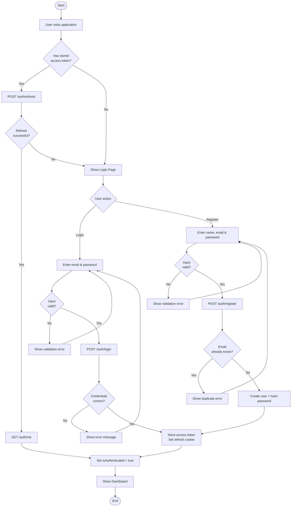
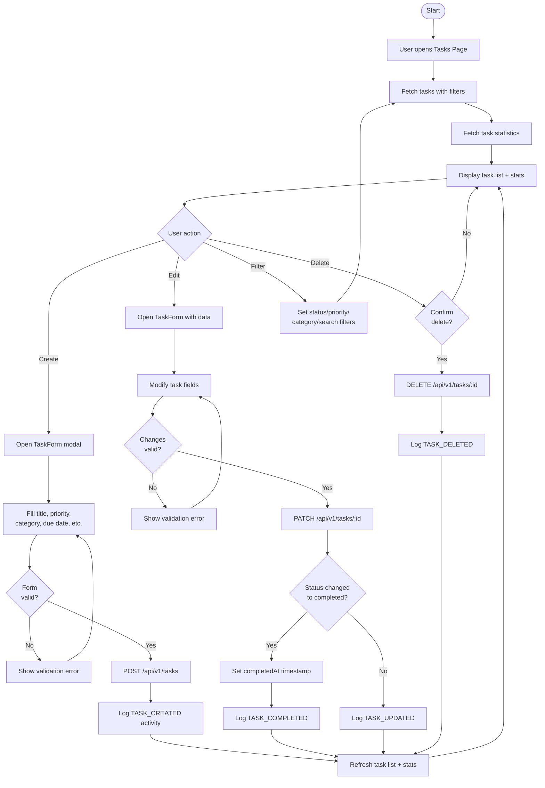
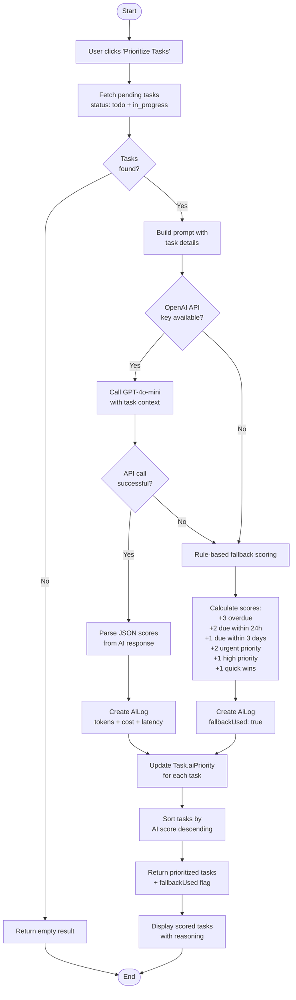
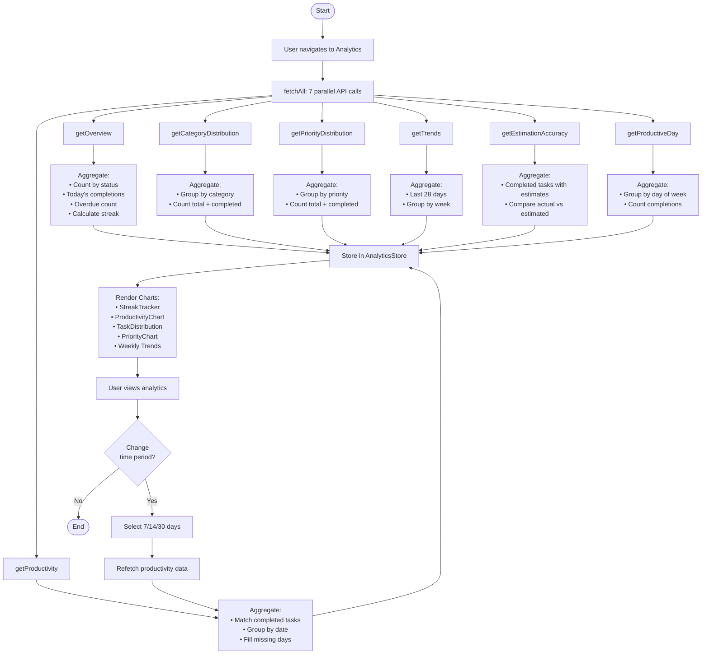

# Activity Diagrams — TaskFlow AI

## 1. User Authentication Flow

```mermaid
flowchart TD
    Start([Start]) --> VisitApp[User visits application]
    VisitApp --> HasToken{Has stored\naccess token?}

    HasToken -->|Yes| TryRefresh[POST /auth/refresh]
    HasToken -->|No| ShowLogin[Show Login Page]

    TryRefresh --> RefreshOk{Refresh\nsuccessful?}
    RefreshOk -->|Yes| FetchProfile[GET /auth/me]
    RefreshOk -->|No| ShowLogin

    FetchProfile --> SetAuth[Set isAuthenticated = true]
    SetAuth --> ShowDashboard[Show Dashboard]

    ShowLogin --> UserChoice{User action}
    UserChoice -->|Login| EnterCreds[Enter email & password]
    UserChoice -->|Register| EnterDetails[Enter name, email & password]

    EnterCreds --> ValidateLogin{Input\nvalid?}
    ValidateLogin -->|No| ShowLoginError[Show validation error]
    ShowLoginError --> EnterCreds

    ValidateLogin -->|Yes| PostLogin[POST /auth/login]
    PostLogin --> LoginOk{Credentials\ncorrect?}
    LoginOk -->|No| ShowAuthError[Show error message]
    ShowAuthError --> EnterCreds
    LoginOk -->|Yes| StoreTokens[Store access token\nSet refresh cookie]
    StoreTokens --> SetAuth

    EnterDetails --> ValidateReg{Input\nvalid?}
    ValidateReg -->|No| ShowRegError[Show validation error]
    ShowRegError --> EnterDetails
    ValidateReg -->|Yes| PostRegister[POST /auth/register]
    PostRegister --> EmailExists{Email\nalready exists?}
    EmailExists -->|Yes| ShowDupError[Show duplicate error]
    ShowDupError --> EnterDetails
    EmailExists -->|No| CreateUser[Create user + hash password]
    CreateUser --> StoreTokens

    ShowDashboard --> End([End])
```

## 2. Task Management Flow

```mermaid
flowchart TD
    Start([Start]) --> ViewTasks[User opens Tasks Page]
    ViewTasks --> LoadTasks[Fetch tasks with filters]
    LoadTasks --> LoadStats[Fetch task statistics]
    LoadStats --> DisplayTasks[Display task list + stats]

    DisplayTasks --> Action{User action}

    Action -->|Create| OpenForm[Open TaskForm modal]
    OpenForm --> FillForm[Fill title, priority,\ncategory, due date, etc.]
    FillForm --> ValidateForm{Form\nvalid?}
    ValidateForm -->|No| ShowFormError[Show validation error]
    ShowFormError --> FillForm
    ValidateForm -->|Yes| SubmitCreate[POST /api/v1/tasks]
    SubmitCreate --> LogCreated[Log TASK_CREATED activity]
    LogCreated --> RefreshList[Refresh task list + stats]
    RefreshList --> DisplayTasks

    Action -->|Edit| OpenEditForm[Open TaskForm with data]
    OpenEditForm --> EditFields[Modify task fields]
    EditFields --> ValidateEdit{Changes\nvalid?}
    ValidateEdit -->|No| ShowEditError[Show validation error]
    ShowEditError --> EditFields
    ValidateEdit -->|Yes| SubmitUpdate[PATCH /api/v1/tasks/:id]
    SubmitUpdate --> IsCompleted{Status changed\nto completed?}
    IsCompleted -->|Yes| SetCompletedAt[Set completedAt timestamp]
    SetCompletedAt --> LogCompleted[Log TASK_COMPLETED]
    IsCompleted -->|No| LogUpdated[Log TASK_UPDATED]
    LogCompleted --> RefreshList
    LogUpdated --> RefreshList

    Action -->|Delete| ConfirmDelete{Confirm\ndelete?}
    ConfirmDelete -->|No| DisplayTasks
    ConfirmDelete -->|Yes| SubmitDelete[DELETE /api/v1/tasks/:id]
    SubmitDelete --> LogDeleted[Log TASK_DELETED]
    LogDeleted --> RefreshList

    Action -->|Filter| ApplyFilters[Set status/priority/\ncategory/search filters]
    ApplyFilters --> LoadTasks
```

## 3. AI Prioritization Flow

```mermaid
flowchart TD
    Start([Start]) --> UserRequest[User clicks 'Prioritize Tasks']
    UserRequest --> FetchTasks[Fetch pending tasks\nstatus: todo + in_progress]
    FetchTasks --> HasTasks{Tasks\nfound?}

    HasTasks -->|No| NoTasks[Return empty result]
    NoTasks --> End([End])

    HasTasks -->|Yes| BuildPrompt[Build prompt with\ntask details]
    BuildPrompt --> TryAI{OpenAI API\nkey available?}

    TryAI -->|Yes| CallOpenAI[Call GPT-4o-mini\nwith task context]
    TryAI -->|No| Fallback

    CallOpenAI --> AISuccess{API call\nsuccessful?}
    AISuccess -->|Yes| ParseResponse[Parse JSON scores\nfrom AI response]
    AISuccess -->|No| Fallback[Rule-based fallback scoring]

    ParseResponse --> LogAI[Create AiLog\ntokens + cost + latency]
    Fallback --> CalculateScores[Calculate scores:\n+3 overdue\n+2 due within 24h\n+1 due within 3 days\n+2 urgent priority\n+1 high priority\n+1 quick wins]
    CalculateScores --> LogFallback[Create AiLog\nfallbackUsed: true]

    LogAI --> UpdateTasks[Update Task.aiPriority\nfor each task]
    LogFallback --> UpdateTasks

    UpdateTasks --> SortByScore[Sort tasks by\nAI score descending]
    SortByScore --> ReturnResults[Return prioritized tasks\n+ fallbackUsed flag]
    ReturnResults --> DisplayScores[Display scored tasks\nwith reasoning]
    DisplayScores --> End
```

## 4. Analytics Data Pipeline

```mermaid
flowchart TD
    Start([Start]) --> Navigate[User navigates to Analytics]
    Navigate --> FetchAll[fetchAll: 7 parallel API calls]

    FetchAll --> Overview[getOverview]
    FetchAll --> Productivity[getProductivity]
    FetchAll --> Categories[getCategoryDistribution]
    FetchAll --> Priorities[getPriorityDistribution]
    FetchAll --> Trends[getTrends]
    FetchAll --> Accuracy[getEstimationAccuracy]
    FetchAll --> ProdDay[getProductiveDay]

    Overview --> AggOverview["Aggregate:\n• Count by status\n• Today's completions\n• Overdue count\n• Calculate streak"]
    Productivity --> AggProd["Aggregate:\n• Match completed tasks\n• Group by date\n• Fill missing days"]
    Categories --> AggCat["Aggregate:\n• Group by category\n• Count total + completed"]
    Priorities --> AggPri["Aggregate:\n• Group by priority\n• Count total + completed"]
    Trends --> AggTrend["Aggregate:\n• Last 28 days\n• Group by week"]
    Accuracy --> AggAcc["Aggregate:\n• Completed tasks with estimates\n• Compare actual vs estimated"]
    ProdDay --> AggDay["Aggregate:\n• Group by day of week\n• Count completions"]

    AggOverview --> StoreData[Store in AnalyticsStore]
    AggProd --> StoreData
    AggCat --> StoreData
    AggPri --> StoreData
    AggTrend --> StoreData
    AggAcc --> StoreData
    AggDay --> StoreData

    StoreData --> RenderCharts["Render Charts:\n• StreakTracker\n• ProductivityChart\n• TaskDistribution\n• PriorityChart\n• Weekly Trends"]
    RenderCharts --> UserView[User views analytics]

    UserView --> ChangeDays{Change\ntime period?}
    ChangeDays -->|Yes| SelectDays[Select 7/14/30 days]
    SelectDays --> RefetchProd[Refetch productivity data]
    RefetchProd --> AggProd
    ChangeDays -->|No| End([End])
```
