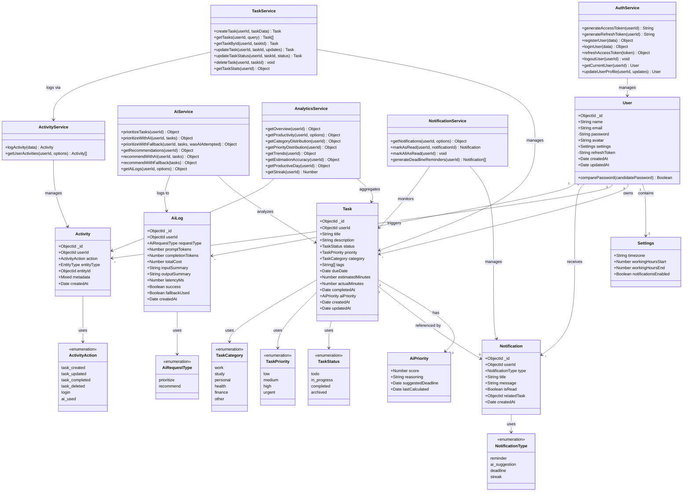

# Class Diagram — TaskFlow AI

```mermaid
classDiagram
    direction TB

    class User {
        +ObjectId _id
        +String name
        +String email
        -String password
        +String avatar
        +Settings settings
        -String refreshToken
        +Date createdAt
        +Date updatedAt
        +comparePassword(candidatePassword) Boolean
    }

    class Settings {
        +String timezone
        +Number workingHoursStart
        +Number workingHoursEnd
        +Boolean notificationsEnabled
    }

    class Task {
        +ObjectId _id
        +ObjectId userId
        +String title
        +String description
        +TaskStatus status
        +TaskPriority priority
        +TaskCategory category
        +String[] tags
        +Date dueDate
        +Number estimatedMinutes
        +Number actualMinutes
        +Date completedAt
        +AiPriority aiPriority
        +Date createdAt
        +Date updatedAt
    }

    class AiPriority {
        +Number score
        +String reasoning
        +Date suggestedDeadline
        +Date lastCalculated
    }

    class Activity {
        +ObjectId _id
        +ObjectId userId
        +ActivityAction action
        +EntityType entityType
        +ObjectId entityId
        +Mixed metadata
        +Date createdAt
    }

    class Notification {
        +ObjectId _id
        +ObjectId userId
        +NotificationType type
        +String title
        +String message
        +Boolean isRead
        +ObjectId relatedTask
        +Date createdAt
    }

    class AiLog {
        +ObjectId _id
        +ObjectId userId
        +AiRequestType requestType
        +Number promptTokens
        +Number completionTokens
        +Number totalCost
        +String inputSummary
        +String outputSummary
        +Number latencyMs
        +Boolean success
        +Boolean fallbackUsed
        +Date createdAt
    }

    class AuthService {
        +generateAccessToken(userId) String
        +generateRefreshToken(userId) String
        +registerUser(data) Object
        +loginUser(data) Object
        +refreshAccessToken(token) Object
        +logoutUser(userId) void
        +getCurrentUser(userId) User
        +updateUserProfile(userId, updates) User
    }

    class TaskService {
        +createTask(userId, taskData) Task
        +getTasks(userId, query) Task[]
        +getTaskById(userId, taskId) Task
        +updateTask(userId, taskId, updates) Task
        +updateTaskStatus(userId, taskId, status) Task
        +deleteTask(userId, taskId) void
        +getTaskStats(userId) Object
    }

    class AiService {
        +prioritizeTasks(userId) Object
        +prioritizeWithAI(userId, tasks) Object
        +prioritizeWithFallback(userId, tasks, wasAIAttempted) Object
        +getRecommendations(userId) Object
        +recommendWithAI(userId, tasks) Object
        +recommendWithFallback(tasks) Object
        +getAiLogs(userId, options) Object
    }

    class AnalyticsService {
        +getOverview(userId) Object
        +getProductivity(userId, options) Object
        +getCategoryDistribution(userId) Object
        +getPriorityDistribution(userId) Object
        +getTrends(userId) Object
        +getEstimationAccuracy(userId) Object
        +getProductiveDay(userId) Object
        +getStreak(userId) Number
    }

    class NotificationService {
        +getNotifications(userId, options) Object
        +markAsRead(userId, notificationId) Notification
        +markAllAsRead(userId) void
        +generateDeadlineReminders(userId) Notification[]
    }

    class ActivityService {
        +logActivity(data) Activity
        +getUserActivities(userId, options) Activity[]
    }

    class TaskStatus {
        <<enumeration>>
        todo
        in_progress
        completed
        archived
    }

    class TaskPriority {
        <<enumeration>>
        low
        medium
        high
        urgent
    }

    class TaskCategory {
        <<enumeration>>
        work
        study
        personal
        health
        finance
        other
    }

    class ActivityAction {
        <<enumeration>>
        task_created
        task_updated
        task_completed
        task_deleted
        login
        ai_used
    }

    class NotificationType {
        <<enumeration>>
        reminder
        ai_suggestion
        deadline
        streak
    }

    class AiRequestType {
        <<enumeration>>
        prioritize
        recommend
    }

    %% Relationships
    User "1" --> "1" Settings : contains
    User "1" --> "*" Task : owns
    User "1" --> "*" Activity : generates
    User "1" --> "*" Notification : receives
    User "1" --> "*" AiLog : triggers

    Task "1" --> "0..1" AiPriority : has
    Task "1" --> "0..*" Notification : referenced by

    Task --> TaskStatus : uses
    Task --> TaskPriority : uses
    Task --> TaskCategory : uses
    Activity --> ActivityAction : uses
    Notification --> NotificationType : uses
    AiLog --> AiRequestType : uses

    AuthService --> User : manages
    TaskService --> Task : manages
    TaskService --> ActivityService : logs via
    AiService --> Task : analyzes
    AiService --> AiLog : logs to
    AnalyticsService --> Task : aggregates
    AnalyticsService --> Activity : aggregates
    NotificationService --> Notification : manages
    NotificationService --> Task : monitors
    ActivityService --> Activity : manages
```
