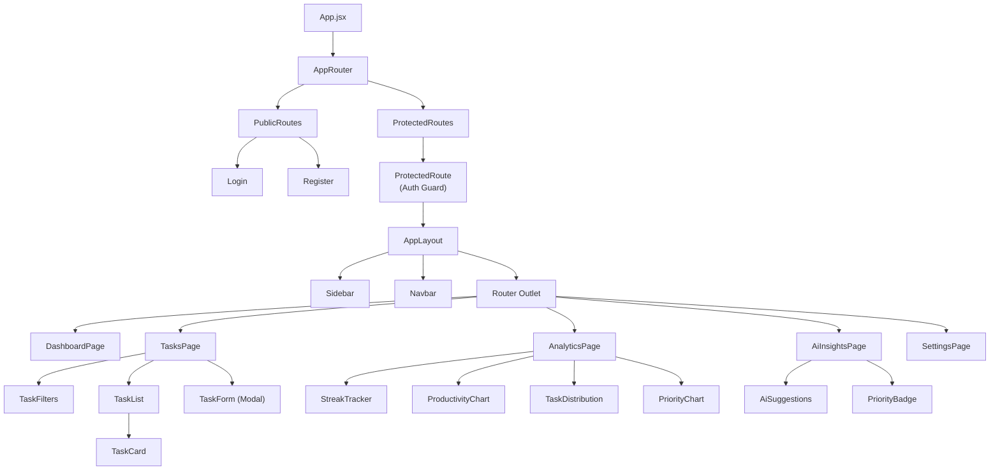
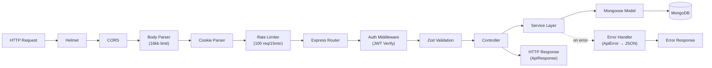

# Component / Architecture Diagram — TaskFlow AI

## System Architecture (3-Tier)

```mermaid
flowchart TB
    subgraph Presentation ["Presentation Layer (React + Vite)"]
        direction TB
        subgraph Pages ["Pages"]
            Login["Login Page"]
            Register["Register Page"]
            Dashboard["Dashboard Page"]
            Tasks["Tasks Page"]
            Analytics["Analytics Page"]
            AiInsights["AI Insights Page"]
            Settings["Settings Page"]
        end
        subgraph UIComponents ["UI Components"]
            AppLayout["AppLayout"]
            Sidebar["Sidebar"]
            Navbar["Navbar"]
            TaskCard["TaskCard"]
            TaskList["TaskList"]
            TaskForm["TaskForm"]
            TaskFilters["TaskFilters"]
            ProductivityChart["ProductivityChart"]
            TaskDistribution["TaskDistribution"]
            PriorityChart["PriorityChart"]
            StreakTracker["StreakTracker"]
            AiSuggestions["AiSuggestions"]
            PriorityBadge["PriorityBadge"]
        end
        subgraph StateManagement ["State Management (Zustand)"]
            AuthStore["useAuthStore"]
            TaskStore["useTaskStore"]
            AiStore["useAiStore"]
            AnalyticsStore["useAnalyticsStore"]
            NotifStore["useNotificationStore"]
        end
        AxiosClient["Axios HTTP Client\n(Interceptors + Token Refresh)"]
    end

    subgraph Application ["Application Layer (Node.js + Express)"]
        direction TB
        subgraph Middleware ["Middleware"]
            AuthMW["Auth (JWT Verify)"]
            RateLimiter["Rate Limiter"]
            Validator["Zod Validator"]
            ErrorHandler["Error Handler"]
            Helmet["Helmet (Security)"]
            CORS["CORS"]
        end
        subgraph Routes ["REST API Routes /api/v1"]
            AuthRoutes["Auth Routes\n/auth"]
            TaskRoutes["Task Routes\n/tasks"]
            AiRoutes["AI Routes\n/ai"]
            AnalyticsRoutes["Analytics Routes\n/analytics"]
            NotifRoutes["Notification Routes\n/notifications"]
        end
        subgraph Controllers ["Controllers"]
            AuthCtrl["AuthController"]
            TaskCtrl["TaskController"]
            AiCtrl["AiController"]
            AnalyticsCtrl["AnalyticsController"]
            NotifCtrl["NotificationController"]
        end
        subgraph Services ["Business Logic Services"]
            AuthSvc["AuthService"]
            TaskSvc["TaskService"]
            AiSvc["AiService"]
            AnalyticsSvc["AnalyticsService"]
            NotifSvc["NotificationService"]
            ActivitySvc["ActivityService"]
        end
    end

    subgraph Data ["Data Layer"]
        direction LR
        subgraph Models ["Mongoose Models"]
            UserModel["User"]
            TaskModel["Task"]
            ActivityModel["Activity"]
            NotifModel["Notification"]
            AiLogModel["AiLog"]
        end
        MongoDB[("MongoDB\nDatabase")]
    end

    subgraph External ["External Services"]
        OpenAI["OpenAI API\n(GPT-4o-mini)"]
    end

    %% Connections
    Pages --> StateManagement
    StateManagement --> AxiosClient
    AxiosClient -->|"HTTP/REST"| Middleware
    Middleware --> Routes
    Routes --> Controllers
    Controllers --> Services
    Services --> Models
    Models --> MongoDB
    AiSvc -->|"API Call"| OpenAI
```

## Frontend Component Hierarchy

```mermaid
flowchart TD
    App["App.jsx"]
    App --> AppRouter

    AppRouter --> PublicRoutes
    AppRouter --> ProtectedRoutes

    PublicRoutes --> Login
    PublicRoutes --> Register

    ProtectedRoutes --> ProtectedRoute["ProtectedRoute\n(Auth Guard)"]
    ProtectedRoute --> AppLayout

    AppLayout --> Sidebar
    AppLayout --> Navbar
    AppLayout --> Outlet["Router Outlet"]

    Outlet --> DashboardPage
    Outlet --> TasksPage
    Outlet --> AnalyticsPage
    Outlet --> AiInsightsPage
    Outlet --> SettingsPage

    TasksPage --> TaskFilters
    TasksPage --> TaskListComp["TaskList"]
    TasksPage --> TaskFormModal["TaskForm (Modal)"]
    TaskListComp --> TaskCard

    AnalyticsPage --> StreakTracker
    AnalyticsPage --> ProductivityChart
    AnalyticsPage --> TaskDistribution
    AnalyticsPage --> PriorityChart

    AiInsightsPage --> AiSuggestions
    AiInsightsPage --> PriorityBadge
```

## Backend Request Pipeline

```mermaid
flowchart LR
    Request["HTTP Request"] --> Helmet
    Helmet --> CORS
    CORS --> BodyParser["Body Parser\n(16kb limit)"]
    BodyParser --> CookieParser["Cookie Parser"]
    CookieParser --> RateLimiter["Rate Limiter\n(100 req/15min)"]
    RateLimiter --> Router["Express Router"]
    Router --> AuthMiddleware["Auth Middleware\n(JWT Verify)"]
    AuthMiddleware --> Validation["Zod Validation"]
    Validation --> Controller
    Controller --> Service["Service Layer"]
    Service --> Model["Mongoose Model"]
    Model --> MongoDB[("MongoDB")]
    Controller --> Response["HTTP Response\n(ApiResponse)"]

    Service -.->|"on error"| ErrorHandler["Error Handler\n(ApiError → JSON)"]
    ErrorHandler --> ErrorResponse["Error Response"]
```
