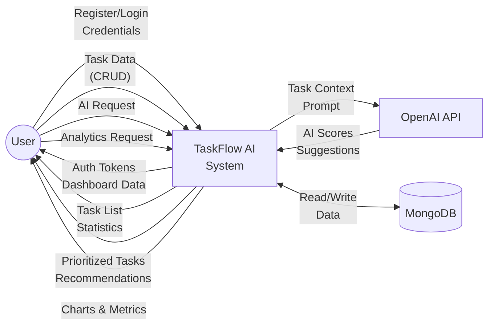
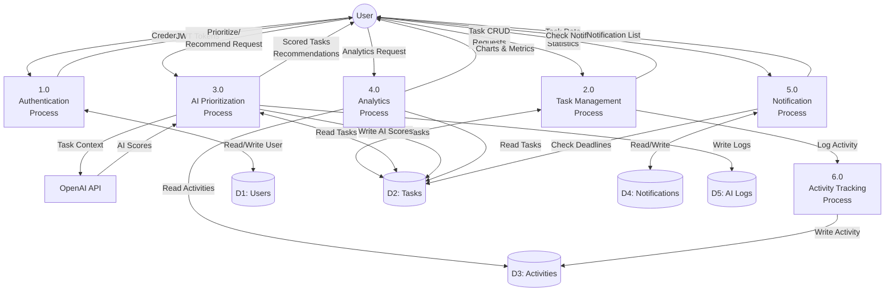
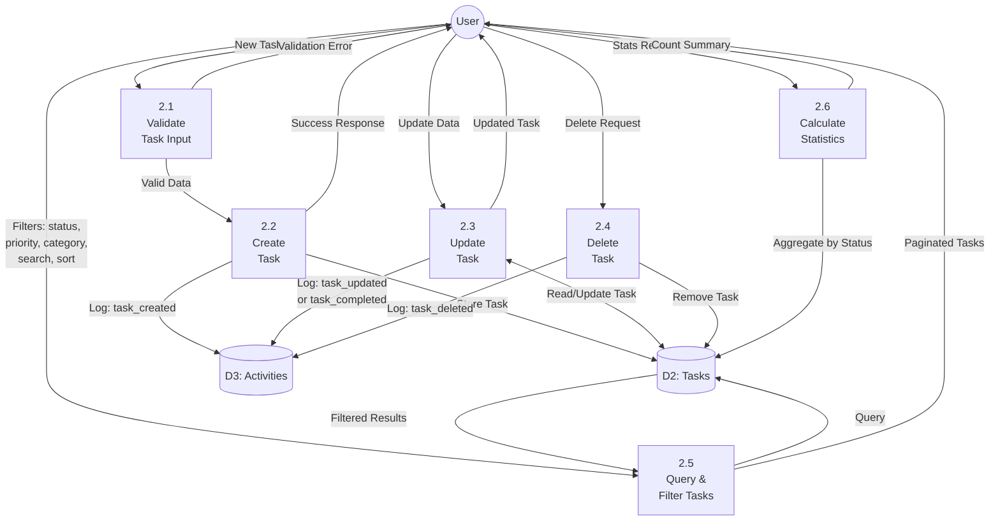

# Data Flow Diagram (DFD) — TaskFlow AI

## Level 0 — Context Diagram

```mermaid
flowchart LR
    User((User))
    System["TaskFlow AI\nSystem"]
    OpenAI["OpenAI API"]
    DB[("MongoDB")]

    User -->|"Register/Login\nCredentials"| System
    System -->|"Auth Tokens\nDashboard Data"| User

    User -->|"Task Data\n(CRUD)"| System
    System -->|"Task List\nStatistics"| User

    User -->|"AI Request"| System
    System -->|"Prioritized Tasks\nRecommendations"| User

    User -->|"Analytics Request"| System
    System -->|"Charts & Metrics"| User

    System -->|"Task Context\nPrompt"| OpenAI
    OpenAI -->|"AI Scores\nSuggestions"| System

    System <-->|"Read/Write\nData"| DB
```

## Level 1 — System Processes

```mermaid
flowchart TB
    User((User))
    OpenAI["OpenAI API"]

    P1["1.0\nAuthentication\nProcess"]
    P2["2.0\nTask Management\nProcess"]
    P3["3.0\nAI Prioritization\nProcess"]
    P4["4.0\nAnalytics\nProcess"]
    P5["5.0\nNotification\nProcess"]
    P6["6.0\nActivity Tracking\nProcess"]

    DS1[("D1: Users")]
    DS2[("D2: Tasks")]
    DS3[("D3: Activities")]
    DS4[("D4: Notifications")]
    DS5[("D5: AI Logs")]

    %% Auth flows
    User -->|"Credentials"| P1
    P1 -->|"JWT Tokens"| User
    P1 <-->|"Read/Write User"| DS1

    %% Task flows
    User -->|"Task CRUD\nRequests"| P2
    P2 -->|"Task Data\nStatistics"| User
    P2 <-->|"Read/Write Tasks"| DS2
    P2 -->|"Log Activity"| P6

    %% AI flows
    User -->|"Prioritize/\nRecommend Request"| P3
    P3 -->|"Scored Tasks\nRecommendations"| User
    P3 -->|"Task Context"| OpenAI
    OpenAI -->|"AI Scores"| P3
    P3 <-->|"Read Tasks"| DS2
    P3 -->|"Write AI Scores"| DS2
    P3 -->|"Write Logs"| DS5

    %% Analytics flows
    User -->|"Analytics Request"| P4
    P4 -->|"Charts & Metrics"| User
    P4 -->|"Read Tasks"| DS2
    P4 -->|"Read Activities"| DS3

    %% Notification flows
    User -->|"Check Notifications"| P5
    P5 -->|"Notification List"| User
    P5 <-->|"Read/Write"| DS4
    P5 -->|"Check Deadlines"| DS2

    %% Activity flows
    P6 -->|"Write Activity"| DS3
```

## Level 2 — Task Management Process Detail

```mermaid
flowchart TB
    User((User))

    P2_1["2.1\nValidate\nTask Input"]
    P2_2["2.2\nCreate\nTask"]
    P2_3["2.3\nUpdate\nTask"]
    P2_4["2.4\nDelete\nTask"]
    P2_5["2.5\nQuery &\nFilter Tasks"]
    P2_6["2.6\nCalculate\nStatistics"]

    DS2[("D2: Tasks")]
    DS3[("D3: Activities")]

    User -->|"New Task Data"| P2_1
    P2_1 -->|"Valid Data"| P2_2
    P2_1 -->|"Validation Error"| User

    P2_2 -->|"Store Task"| DS2
    P2_2 -->|"Log: task_created"| DS3
    P2_2 -->|"Success Response"| User

    User -->|"Update Data"| P2_3
    P2_3 <-->|"Read/Update Task"| DS2
    P2_3 -->|"Log: task_updated\nor task_completed"| DS3
    P2_3 -->|"Updated Task"| User

    User -->|"Delete Request"| P2_4
    P2_4 -->|"Remove Task"| DS2
    P2_4 -->|"Log: task_deleted"| DS3

    User -->|"Filters: status,\npriority, category,\nsearch, sort"| P2_5
    P2_5 -->|"Query"| DS2
    DS2 -->|"Filtered Results"| P2_5
    P2_5 -->|"Paginated Tasks"| User

    User -->|"Stats Request"| P2_6
    P2_6 -->|"Aggregate by Status"| DS2
    P2_6 -->|"Count Summary"| User
```
