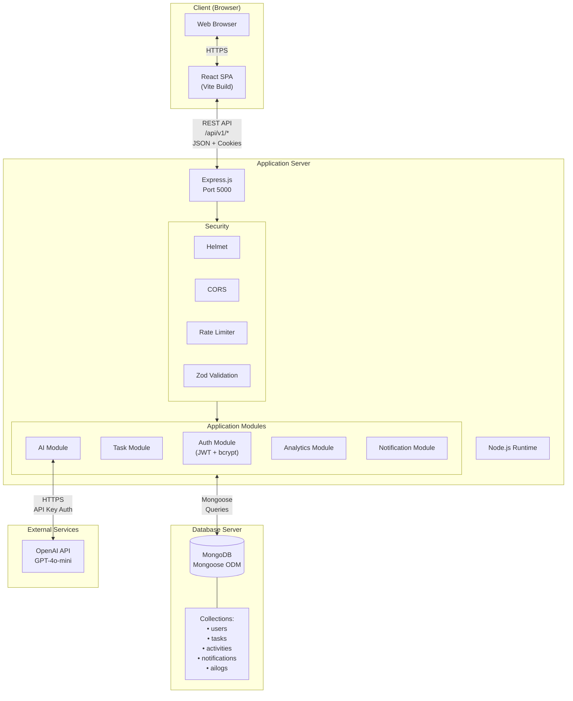
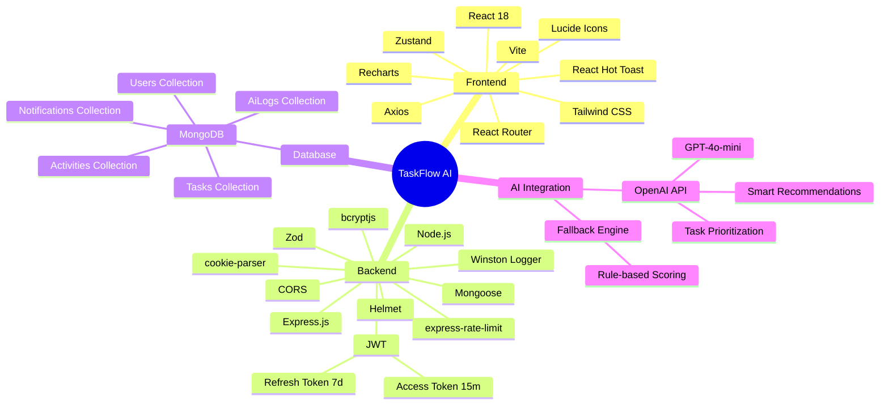

# Deployment Diagram — TaskFlow AI

```mermaid
flowchart TB
    subgraph Client ["Client (Browser)"]
        Browser["Web Browser"]
        ReactApp["React SPA\n(Vite Build)"]
    end

    subgraph Server ["Application Server"]
        NodeJS["Node.js Runtime"]
        Express["Express.js\nPort 5000"]
        subgraph AppModules ["Application Modules"]
            AuthModule["Auth Module\n(JWT + bcrypt)"]
            TaskModule["Task Module"]
            AIModule["AI Module"]
            AnalyticsModule["Analytics Module"]
            NotifModule["Notification Module"]
        end
        subgraph SecurityModules ["Security"]
            HelmetSec["Helmet"]
            CORSSec["CORS"]
            RateLimitSec["Rate Limiter"]
            ZodSec["Zod Validation"]
        end
    end

    subgraph Database ["Database Server"]
        MongoDB[("MongoDB\nMongoose ODM")]
        Collections["Collections:\n• users\n• tasks\n• activities\n• notifications\n• ailogs"]
    end

    subgraph ExternalAPI ["External Services"]
        OpenAI["OpenAI API\nGPT-4o-mini"]
    end

    Browser <-->|"HTTPS"| ReactApp
    ReactApp <-->|"REST API\n/api/v1/*\nJSON + Cookies"| Express
    Express --> SecurityModules
    SecurityModules --> AppModules
    AppModules <-->|"Mongoose\nQueries"| MongoDB
    MongoDB --- Collections
    AIModule <-->|"HTTPS\nAPI Key Auth"| OpenAI
```

## Technology Stack Summary

```mermaid
mindmap
    root((TaskFlow AI))
        Frontend
            React 18
            Vite
            Tailwind CSS
            Zustand
            Axios
            React Router
            Recharts
            React Hot Toast
            Lucide Icons
        Backend
            Node.js
            Express.js
            Mongoose
            JWT
                Access Token 15m
                Refresh Token 7d
            bcryptjs
            Zod
            Helmet
            CORS
            Winston Logger
            express-rate-limit
            cookie-parser
        Database
            MongoDB
                Users Collection
                Tasks Collection
                Activities Collection
                Notifications Collection
                AiLogs Collection
        AI Integration
            OpenAI API
                GPT-4o-mini
                Task Prioritization
                Smart Recommendations
            Fallback Engine
                Rule-based Scoring
```
