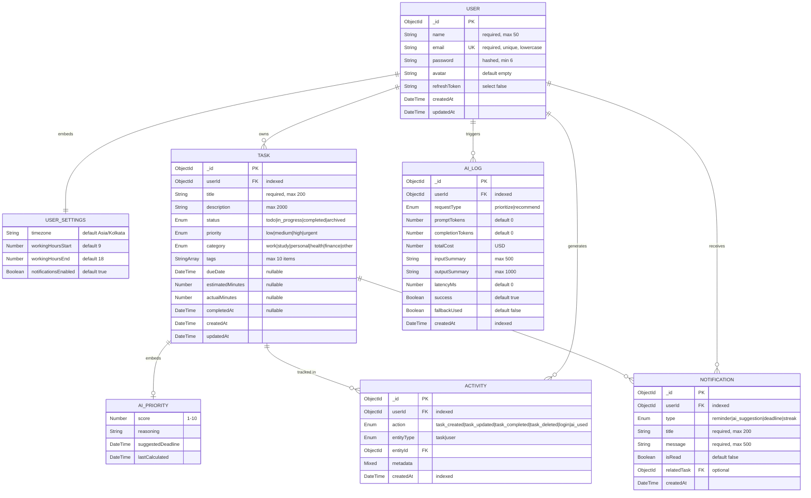

# ER Diagram — TaskFlow AI

```mermaid
erDiagram
    USER {
        ObjectId _id PK
        String name "required, max 50"
        String email UK "required, unique, lowercase"
        String password "hashed, min 6"
        String avatar "default empty"
        String refreshToken "select false"
        DateTime createdAt
        DateTime updatedAt
    }

    USER_SETTINGS {
        String timezone "default Asia/Kolkata"
        Number workingHoursStart "default 9"
        Number workingHoursEnd "default 18"
        Boolean notificationsEnabled "default true"
    }

    TASK {
        ObjectId _id PK
        ObjectId userId FK "indexed"
        String title "required, max 200"
        String description "max 2000"
        Enum status "todo|in_progress|completed|archived"
        Enum priority "low|medium|high|urgent"
        Enum category "work|study|personal|health|finance|other"
        StringArray tags "max 10 items"
        DateTime dueDate "nullable"
        Number estimatedMinutes "nullable"
        Number actualMinutes "nullable"
        DateTime completedAt "nullable"
        DateTime createdAt
        DateTime updatedAt
    }

    AI_PRIORITY {
        Number score "1-10"
        String reasoning
        DateTime suggestedDeadline
        DateTime lastCalculated
    }

    ACTIVITY {
        ObjectId _id PK
        ObjectId userId FK "indexed"
        Enum action "task_created|task_updated|task_completed|task_deleted|login|ai_used"
        Enum entityType "task|user"
        ObjectId entityId FK
        Mixed metadata
        DateTime createdAt "indexed"
    }

    NOTIFICATION {
        ObjectId _id PK
        ObjectId userId FK "indexed"
        Enum type "reminder|ai_suggestion|deadline|streak"
        String title "required, max 200"
        String message "required, max 500"
        Boolean isRead "default false"
        ObjectId relatedTask FK "optional"
        DateTime createdAt
    }

    AI_LOG {
        ObjectId _id PK
        ObjectId userId FK "indexed"
        Enum requestType "prioritize|recommend"
        Number promptTokens "default 0"
        Number completionTokens "default 0"
        Number totalCost "USD"
        String inputSummary "max 500"
        String outputSummary "max 1000"
        Number latencyMs "default 0"
        Boolean success "default true"
        Boolean fallbackUsed "default false"
        DateTime createdAt "indexed"
    }

    USER ||--|| USER_SETTINGS : "embeds"
    USER ||--o{ TASK : "owns"
    USER ||--o{ ACTIVITY : "generates"
    USER ||--o{ NOTIFICATION : "receives"
    USER ||--o{ AI_LOG : "triggers"
    TASK ||--o| AI_PRIORITY : "embeds"
    TASK ||--o{ NOTIFICATION : "referenced by"
    TASK ||--o{ ACTIVITY : "tracked in"
```
