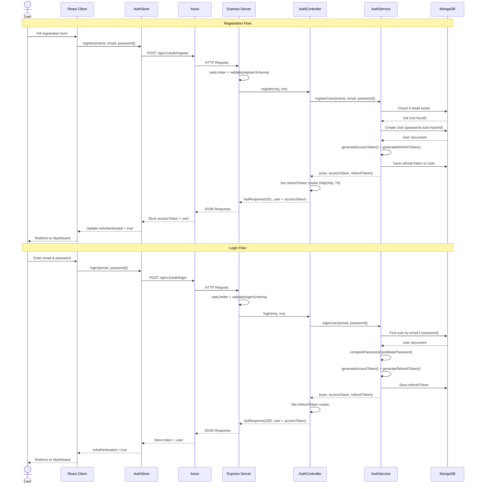
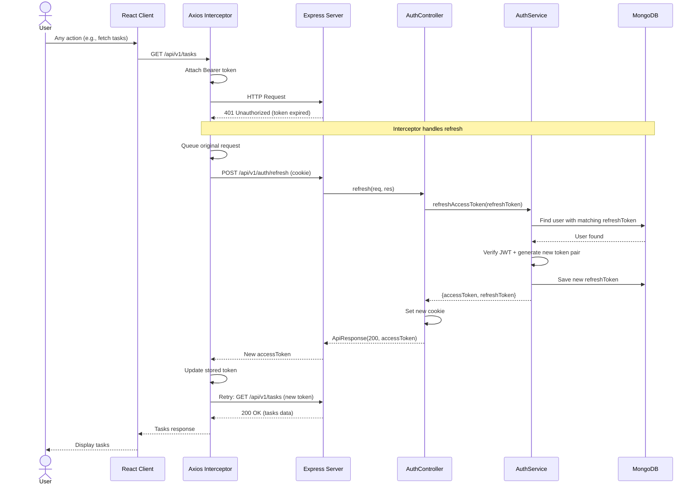
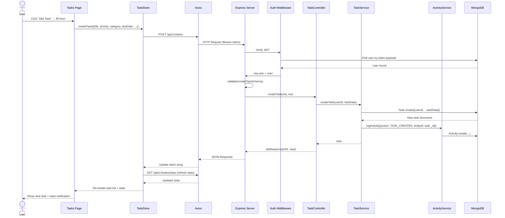
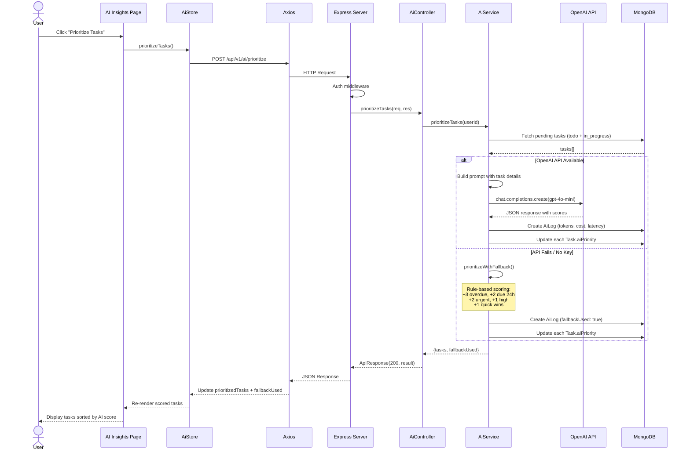
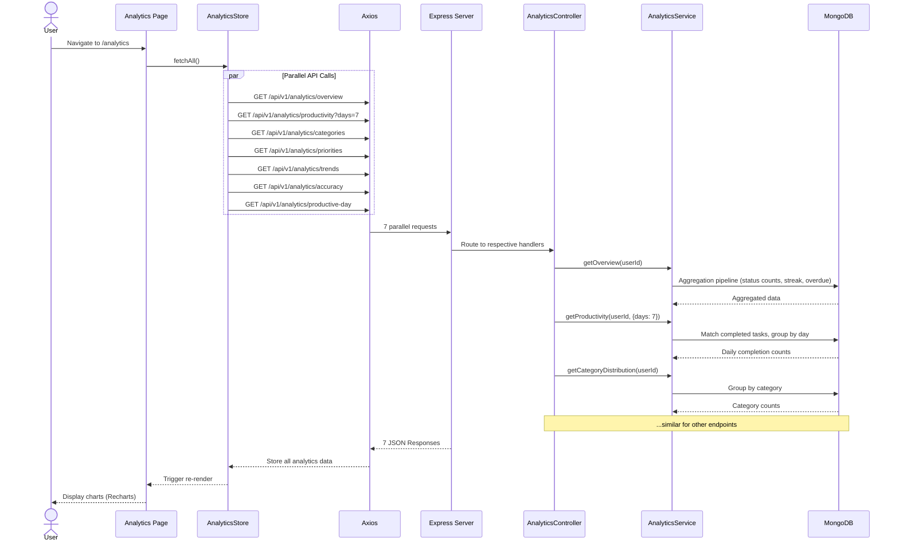
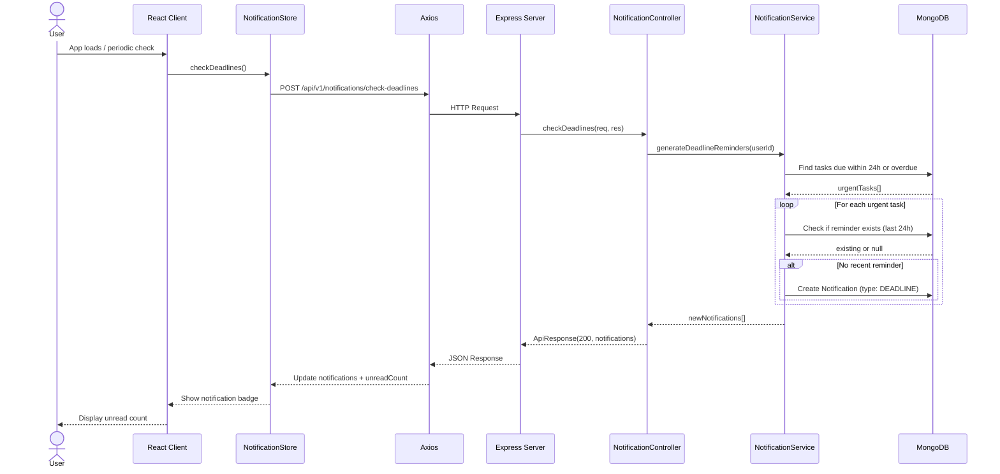

# Sequence Diagrams — TaskFlow AI

## 1. User Registration & Login

## 2. Token Refresh (Automatic)

## 3. Create Task

## 4. AI Task Prioritization

## 5. Analytics Dashboard Loading

## 6. Deadline Notification Check

