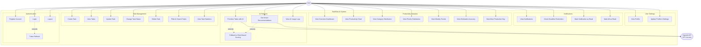

# Use Case Diagram — TaskFlow AI

```mermaid
flowchart TB
    subgraph System ["TaskFlow AI System"]
        direction TB

        subgraph Auth ["Authentication"]
            UC1["Register Account"]
            UC2["Login"]
            UC3["Logout"]
            UC4["Token Refresh"]
        end

        subgraph TaskMgmt ["Task Management"]
            UC5["Create Task"]
            UC6["View Tasks"]
            UC7["Update Task"]
            UC8["Change Task Status"]
            UC9["Delete Task"]
            UC10["Filter & Search Tasks"]
            UC11["View Task Statistics"]
        end

        subgraph AI ["AI Features"]
            UC12["Prioritize Tasks with AI"]
            UC13["Get Smart Recommendations"]
            UC14["View AI Usage Logs"]
            UC15["Fallback to Rule-Based Scoring"]
        end

        subgraph Analytics ["Productivity Analytics"]
            UC16["View Overview Dashboard"]
            UC17["View Productivity Chart"]
            UC18["View Category Distribution"]
            UC19["View Priority Distribution"]
            UC20["View Weekly Trends"]
            UC21["View Estimation Accuracy"]
            UC22["View Most Productive Day"]
        end

        subgraph Notif ["Notifications"]
            UC23["View Notifications"]
            UC24["Check Deadline Reminders"]
            UC25["Mark Notification as Read"]
            UC26["Mark All as Read"]
        end

        subgraph Profile ["User Settings"]
            UC27["View Profile"]
            UC28["Update Profile & Settings"]
        end
    end

    User((User))
    OpenAI([OpenAI API\nGPT-4o-mini])

    User --> UC1
    User --> UC2
    User --> UC3
    UC2 -.->|"extends"| UC4

    User --> UC5
    User --> UC6
    User --> UC7
    User --> UC8
    User --> UC9
    User --> UC10
    User --> UC11

    User --> UC12
    User --> UC13
    User --> UC14
    UC12 -.->|"extends"| UC15
    UC13 -.->|"extends"| UC15

    User --> UC16
    User --> UC17
    User --> UC18
    User --> UC19
    User --> UC20
    User --> UC21
    User --> UC22

    User --> UC23
    User --> UC24
    User --> UC25
    User --> UC26

    User --> UC27
    User --> UC28

    UC12 --> OpenAI
    UC13 --> OpenAI
```
